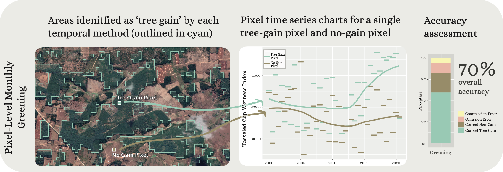
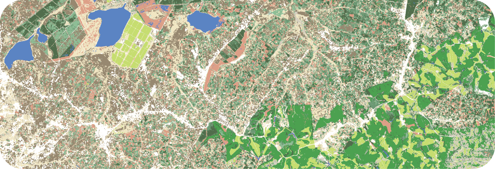
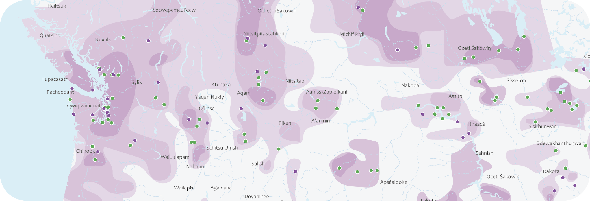
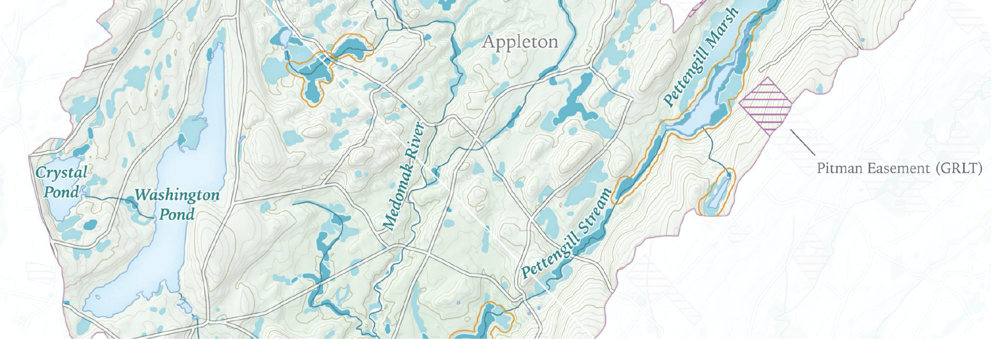
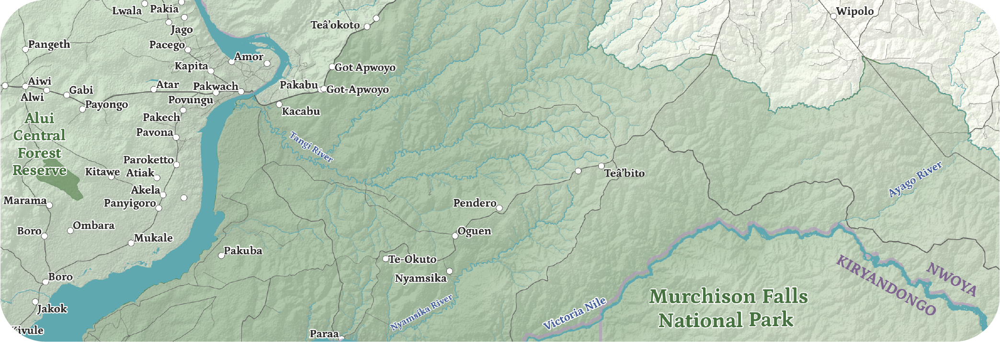

## Remote Sensing Research

#### Temporal Methods in Woodlot Detection
As research assistants working with Professor Kimambo, Brooke Laird and I developed this poster representing our efforts to compare different temporal methods for mapping woodlots from Landsat and Sentinel imagery. We presented at the Spring Symposium in 2021, in a forum with many poster presenters from other departments and fields of study. Essentially, we found that classifying a stack of monthly Tasseled Cap Wetness images out-performed two other algorithms used in temporal classification, LandTrendr and CCDC.

#### Image Segmentation and Woodlot Mapping
Leveraging high-resolution Planet Labs satellite imagery for accurate woodlot mapping in Tanzania has been one of my favorite projects at Middlebury College. I produced this map independently at the end of summer 2021, which I spent in Middlebury doing research with Professor Kimambo and Leo Sovell-Fernandez. This semester (spring 2022) I am continuing my analysis of Planet Labs imagery, extending the landcover classification over a much larger area, for the purposes of comparison among 67 study villages.

## Cartography Projects

#### Indigenous Community Across the US-Canada Border
This map, recently submitted to the Stanford Re-Mapping Sovereignty Conference and the *Borders in Globalization Review*, depicts indigneous community extending across the US-Canada border, using tribal names, points of community, and Romer-style isolines of population density. Kate Talano and I designed this map under the advising of Professor Herb, who furnished the concept and layout ideas. 

#### Maine Watersheds
In January 2021, I designed this series of maps addressing conservation potential in midcoast Maine, focusing on wetlands and waterfowl habitat in the Medomak Pond watershed and in the town of Appleton. The goal was to assess how well conservation easements in the area align with wetlands, and where there could be more specific protection.

#### Uganda Field Study Map
I am proud to have produced this map of northwest Uganda for use in a historical field study, with a tight turnaround of less than a week during fall break. With little time to polish the map, it may not represent my finest cartography to date, but I was overjoyed to receive pictures of the map being appreciated and used for village surveys.

#### Maine Eagle Nesting Map
In my first year at Middlebury College, I designed this map for my final project in Cartographic Design, GEOG 0325. I was excited to find a dataset with coordinates for all the active bald eagle nests in Maine, so I decided to spin that idea into a map such as I would be happy to have decorating a wall in my dorm room.

